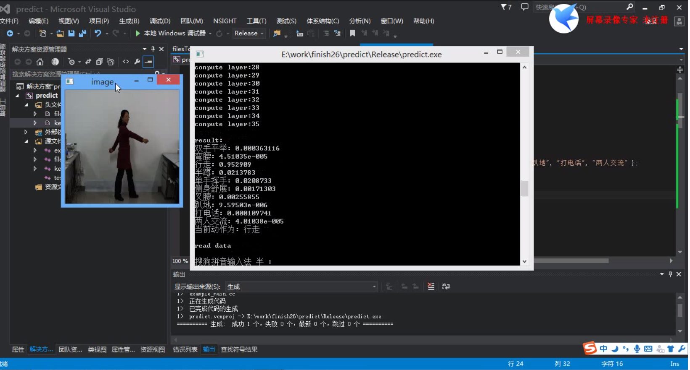
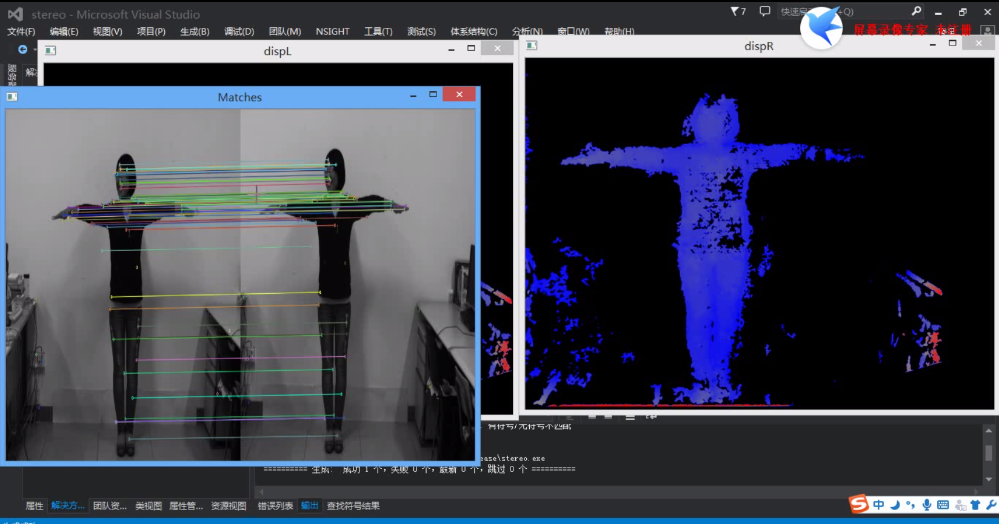

# PosematchAndRecognition

实现基于双目的十个动作识别

##运行说明
程序都是用vs2013+opencv2.4.9.opencv已打包在内
在matchAndRecognition里面训练文件夹是我整理好的图片数据
Script文件夹是python文件，里面HumanActionRecognitionTrain.py是整个的训练文件，HumanActionRecognitionPredictAll.py是python全部图片的识别文件。Subm里面有一个全部文件的识别结果。
Out文件夹是c++每一张图片的识别结果。
主要程序在main文件夹里面。里面MODE改为MATCH问匹配，给为RECOGNITION为识别。
改下面这句话就可了。
define MODE RECOGNITION				//两种模式,MATCH为选择去匹配获取深度图，RECOGNITION为识别

cnn1.dumped是c++识别使用的训练好的模型和权重文件。
whole_model.h5是python识别使用的训练好的模型和权重文件。

Python程序是基于keras框架写的。所以要配置环境。环境配置参考
http://keras-cn.readthedocs.io/en/latest/getting_started/keras_windows/。

script里面是Python使用keras训练和测试的程序
使用的网络是vgg16

c++使用了keras_model.cc程序去调用keras模型,这里完全没有优化,加载网络和前向传递非常慢.

效果

